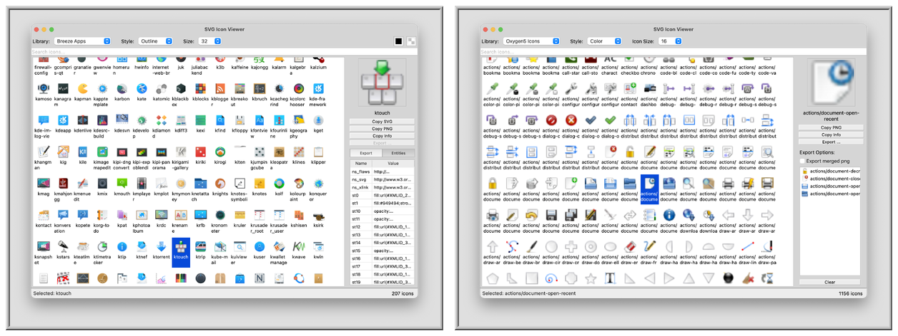

#  Icon Viewer

A Qt-based desktop application for browsing, previewing, and exporting icons from multiple open-source icon collections. Supports both SVG vector icons and PNG bitmap icons.

# 

## Features

- Browse 15,000+ icons from Bootstrap, Tabler, Fluent UI, Breeze, Oxygen, and Oxygen5 collections
- Real-time search filtering
- Customizable fill and background colors (SVG icons)
- Copy to clipboard (SVG or PNG)
- Export to file (SVG or PNG)
- Multiple icon size options
- Support for both SVG vector and PNG bitmap icon formats

## Supported Icon Libraries

### SVG Icons

| Library | Icons | Sizes | Styles | Source |
|---------|-------|-------|--------|--------|
| Bootstrap | ~2,000 | 16px | Regular, Fill | [twbs/icons](https://github.com/twbs/icons) |
| Tabler | ~5,000 | 24px | Outline, Filled | [tabler/tabler-icons](https://github.com/tabler/tabler-icons) |
| Fluent UI | ~4,000 | 10-48px | Regular, Filled | [microsoft/fluentui-system-icons](https://github.com/microsoft/fluentui-system-icons) |
| Breeze | ~700 | 12-64px | By category | [KDE/breeze-icons](https://github.com/KDE/breeze-icons) |

### Bitmap Icons (PNG)

| Library | Icons | Sizes | Source |
|---------|-------|-------|--------|
| Oxygen | ~2,500 | 16-256px | [ArtifexSoftware/ArtifexSoftware.github.io](https://github.com/ArtifexSoftware/ArtifexSoftware.github.io) |
| Oxygen5 | ~2,500 | 16-256px | [ArtifexSoftware/ArtifexSoftware.github.io](https://github.com/ArtifexSoftware/ArtifexSoftware.github.io) |

## Build

### Requirements

- Qt 6.x (Widgets, SVG, SQL modules)
- Python 3.x (for icon library generation)
- C++17 compiler

### Steps

```bash
# 1. Generate icon libraries (first time only)
cd library
python3 generator.py
cd ..

# 2. Build
qmake6 Icons.pro
make

# 3. Run
./build-macx-clang/Icons.app/Contents/MacOS/Icons
```

## Project Structure

```
Icons/
├── icons.cpp/h          # Main window
├── iconmodel.cpp/h      # Icon data model with filtering
├── icongrid.cpp/h       # Grid view, toolbar, preview panel
├── library/
│   ├── generator.py     # Icon extraction and code generation
│   ├── lib_svgiconlist.h # Icon list interface
│   ├── lib_*.h          # Generated icon list classes
│   ├── svg_*.c          # Generated icon name arrays
│   └── content/         # Extracted SVG body files
└── collections/         # Reference Delphi sources
```

## Reference

Based on [SVGIconViewer](https://github.com/skamradt/SVGIconViewer) by skamradt.

## License

Icon libraries are used under their respective licenses (MIT for Bootstrap, Tabler, Fluent UI; LGPL for Breeze).
